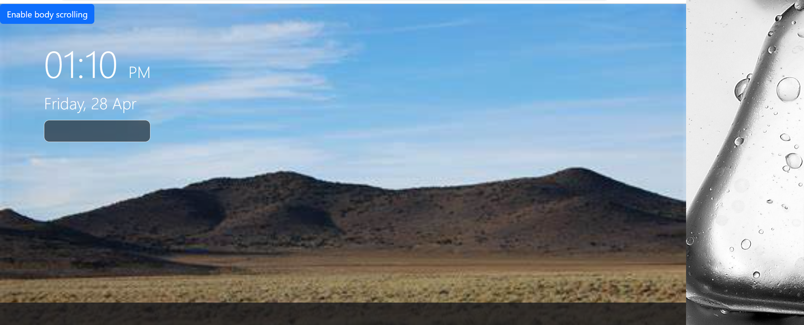

# <Title>
Weather-App

## Desciption

I wanted to test my skills on an app that uses an API. The basis behind this weather app is that it needed 2 API's. One for the current day and another API for the next 5 day forecast. 
I learned how to skip on a for loop, it was to late for me to put it on the script.js, for example (let i = 0; i < something.length; i+=8). It also taught me about local storage.

[Installation](#Installation)
[Usage](#usage)

## Installation
I is a every basic program to install you just hit the go live spot emblem at the bottom right corner of the screen in blue.

## usage
This site can be used to see the weather at this moment. The next 5 day forecast will be up-dated at 12am mid-night. After searching for a location it will be saved to local storage, this will make it is easier for the next time it will be searched.

## Features
current day API
5 day forecast API
local storage
bootstrap

## screen shoot

